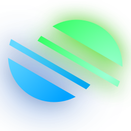

# GeoDuels

A free multiplayer geography game with community maps and competitive duels. Play at [geoduels.io](https://geoduels.io/).

Not a pretty readme, but does the job.

## Running GeoDuels yourself

### Development

You need Docker, Go 1.26, and Node 22 (matching CI). All commands run from the repository root.

```sh
cp backend/.env.example backend/.env
cp web/.env.local.example web/.env.local

cd backend
go run github.com/sqlc-dev/sqlc/cmd/sqlc@v1.30.0 generate
cd ..

docker compose -f backend/dev.yaml up -d postgres redis
./backend/scripts/migrate.sh up
docker compose -f backend/dev.yaml up -d

npm --prefix web ci
npm --prefix web run dev
```

Open `http://localhost:3000`. On startup the gameplay node imports the bundled sample dataset for any required playable map that is not configured yet (`DEV_MAP_DATASET` in `backend/dev.yaml`; it never replaces existing maps). Start optional workers with `docker compose -f backend/dev.yaml up -d moderation-worker discord-worker`; stop everything with `docker compose -f backend/dev.yaml down`.

### Self-hosted

The self-hosted stack (`backend/selfhosted.yaml`) runs the published images with all services bound to host loopback only; nginx (or any reverse proxy) on the same host is the single public entrypoint. Fill in `backend/beta.secrets.env` (never committed), then on the host:

```sh
docker compose --env-file backend/beta.secrets.env -f backend/selfhosted.yaml up -d
docker compose --env-file backend/beta.secrets.env -f backend/selfhosted.yaml run --rm db-migrate
```

Build and push the images first with `docker buildx bake` (see [development notes](docs/development.md)).

## Development references

- [AGENTS.md](AGENTS.md): constraints and cross-cutting behavior to preserve.
- [Development notes](docs/development.md): generated code, meaningful verification, local infrastructure, releases, and map tools.
- [Extension notes](extension/README.md): local installation and production packaging.
- [Contributor agreement](CONTRIBUTOR_LICENSE_AGREEMENT.md) and [license](LICENSE): contribution and licensing terms.
